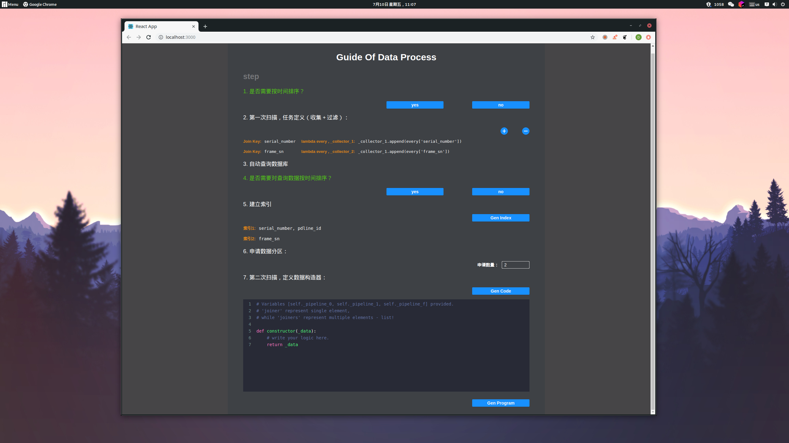

# data-proc-code-gen

The project is a react app, which can collect settings filled in by user from page to generate python data process program.

## Description

I recently found that javascript is a very interesting language, especially ecmascript6. Cause I'm writing several big data processing projects, and some of the missions are very similar. So, I decide to write a python-code-gen front-end application to help me produce these programs. At past, I just wrote a little piece of javascript, css and html. However, I researched a lot of front-end tech, like react, webpack, es6, typescript, node, and ... Finally! I can take advantage of these teches.

## Build

I just submited the key source files to keep the project pure. So, if you are interesting in the project, I suggest you create a react app by using `create-react-app` utility. Than, move all of the project files to that project root directory.

## Dependency

I used `codemirror` to implement python syntax highlight. So, after install `codemirror`, you should copy the `codemirror` dependency to the `public` directory of the project.

Install command:

- `yarn add antd`
- `yarn add codemirror@5.52.0`

Beside, I found the lastest `codemirror` exists some problems. It can not display the syntax highlight very well! So, I suggect you install version 5.52.0.
